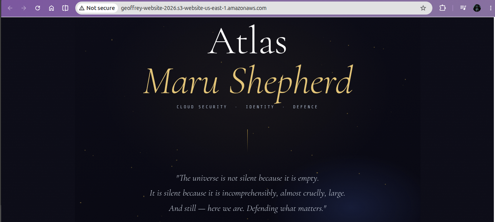

# Week 4 — Cloud Storage: S3, Versioning & Data Protection

**AWS Cloud Security Roadmap | Phase 1 — Foundations**

> This is Week 4 of a structured 6-month AWS Cloud Security program.
> Storage concepts established here underpin the EBS persistence
> behaviour observed in
> [Week 5 — Hardened EC2 Web Server](https://github.com/Atlas-ghostshell/Hardened-EC2-Web-Server),
> where user data scripts wrote to EBS on first launch and persisted
> across all subsequent reboots.

---

## Overview

Data is the target. Before securing an environment, you need to
understand how cloud storage works — how data is organised, how
long it lives, how it's protected, and how it's recovered when
something goes wrong.

Week 4 established the storage layer: what the options are, when
to use each, and how to apply durability and protection controls
that hold up under real conditions.

---

## Deliverable

A static website hosted on an S3 bucket with public access enabled
for URL accessibility, versioning enabled from initial setup, and
file recovery tested against a previous object version.

The bucket holds a single `index.html` file — no sensitive data,
public access intentionally scoped to that purpose.

*Static website served via S3 public URL — versioning enabled at
bucket creation.*

---

## Concepts Covered

### S3 — Simple Storage Service
Object-based storage built for durability and scale. Unlike block
storage, S3 stores data as discrete objects — each with its own
key, metadata, and value. Storage classes determine the cost and
access speed tradeoff:

| Storage Class | Use Case |
|---------------|----------|
| S3 Standard | Frequently accessed data |
| S3 Standard-IA | Infrequent access, rapid retrieval |
| S3 Glacier | Long-term archival, retrieval in minutes to hours |
| S3 Glacier Deep Archive | Cold archival, lowest cost, hours retrieval |

The right storage class is a cost and recovery decision — choosing
wrong means paying for speed you don't need or waiting hours for
data you need immediately.

### Versioning
A bucket-level feature that retains every version of every object
uploaded. When versioning is enabled, deleting an object places a
delete marker rather than permanently removing it — the previous
version remains retrievable. Accidental overwrites and deletions
become recoverable events rather than data loss incidents.

Versioning is one of the simplest data protection controls available
in S3. It costs nothing to enable and eliminates an entire class of
human error.

### EBS — Elastic Block Store
Block storage attached directly to an EC2 instance — functionally
equivalent to a hard drive. EBS volumes persist independently of
the instance lifecycle: stopping or terminating an instance does
not automatically delete the attached EBS volume unless configured
to do so. One EBS volume attaches to one instance at a time.

Security relevance: EBS snapshots should be taken before any
remediation action on a compromised instance. Snapshots preserve
the forensic state — data and configuration intact before the
environment is altered.

### EFS — Elastic File System
A managed network file system that can be mounted concurrently
across multiple EC2 instances. Unlike EBS, EFS is shared storage —
many instances read and write to the same filesystem simultaneously.

| | EBS | EFS |
|-|-----|-----|
| Attached to | Single EC2 instance | Multiple EC2 instances |
| Access | Block-level | File-level (NFS) |
| Use case | OS volumes, databases | Shared app data, containers |

### Lifecycle Policies
Automated rules that manage object transitions and expiration inside
an S3 bucket. A lifecycle policy can move objects between storage
classes as they age or permanently delete them after a defined
period — no manual intervention required.

Security and cost relevance: old versions of objects and incomplete
multipart uploads accumulate silently. Without lifecycle policies,
they become both a cost liability and a data residency risk —
sensitive old versions persist indefinitely unless explicitly
managed.

### Encryption at Rest
Data encrypted as it is written to storage. Even on full
compromise of the bucket or underlying infrastructure, an attacker
cannot read the data without the decryption keys.

AWS S3 offers three encryption options:
- **SSE-S3** — AWS manages keys entirely
- **SSE-KMS** — keys managed via AWS KMS, full audit trail via
  CloudTrail
- **SSE-C** — customer provides and manages keys entirely

SSE-KMS is the preferred option in security-sensitive environments
— every key usage is logged, access can be revoked, and key
rotation is enforceable.

---

## What This Built Toward

| Concept | Week 4 | Week 5 |
|---------|--------|--------|
| Storage type | S3 object storage | EBS block storage |
| Persistence | Object versioning | EBS persists across reboots |
| Data protection | Encryption at rest | IMDSv2 enforcement |
| Recovery control | Version rollback | EBS snapshot before remediation |

Week 4 established how cloud storage works and how to protect it.
Week 5 demonstrated that same EBS persistence behaviour in a live
EC2 environment — user data ran once, wrote to EBS, and served
correctly on every subsequent boot.

---

## Repository
Part of the [AWS Cloud Security Roadmap](https://github.com/Atlas-ghostshell)
